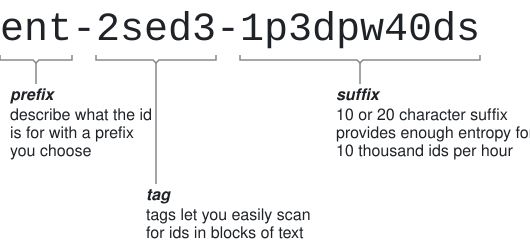

# ajanuary's friendly identifier

The afid id format is designed to meet the trade-off between space and human
readability.

It encodes either 80 or 120 bits of randomness into a string of up to 48
characters using an alphabet of lowercase letters, numbers and hyphens.



## Variants
Afids come in two variants: short and long.

Short afids are designed for scenarios where you are generating less than 10
thousand afids per hour. They allow for shorter ids and longer prefixes.

Long afids are designed for scenarios where you are generating between 10
thousand and a billion afids per hour, at the cost of longer ids and less space
available for prefixes.

| Variant | Bits of randomness | Max ids per hour  | Max prefix length | ID Length          |
| ------- | ------------------ | ----------------- | ----------------- | ------------------ |
| Short   | 80                 | 10,000            | 31                | `len(prefix) + 17` |
| Long    | 120                | 1,000,000,000,000 | 21                | `len(prefix) + 27` |

## Grammar
For short afids, `n = 10`. For long afids, `n = 20`

```
AFID            ::= PREFIX "-" TAG "-" SUFFIX
PREFIX          ::= 1*(41-n) PREFIX-ALPHABET
TAG             ::= 5 RAND-ALPHABET
SUFFIX          ::= n RAND-ALPHABET
PREFIX-ALPHABET ::= "0" | "1" | "2" | "3" | "4" | "5" | "6" | "7" | "8" | "9" |
                    "a" | "b" | "c" | "d" | "e" | "f" | "g" | "h" | "i" | "j" |
                    "k" | "l" | "m" | "n" | "o" | "p" | "q" | "r" | "s" | "t" |
                    "u" | "v" | "w" | "x" | "y" | "z" | "-"
RAND-ALPHABET   ::= "0" | "1" | "2" | "3" | "4" | "5" | "6" | "7" | "8" | "9" |
                    "a" | "b" | "c" | "d" | "e" | "f" | "g" | "h" | "j" | "k" |
                    "m" | "n" | "p" | "q" | "r" | "s" | "t" | "v" | "w" | "x" |
                    "y" | "z"
```

## Description
The prefix is a string of lowercase letters, numbers and hyphens that can be
used to encode whatever information would be useful to a human reader.
Typically this is the type of resource the afid is for.

The tag and suffix encode 5 bits of randomness per character. The alphabet used
here is based on Crockford's Base32 encoding. This omits characters that are
often confused for other characters or numbers.

The use of lowercase letters, as well as splitting out 5 characters into the
tag, are designed to make it easier to read and scan.

Because afids are generated from random bits, you don't need a centralized id
service to generate them for you.

The maximum length of 48 is useful for specifying upper limits in database
column sizes and API schemas. While afids can be made shorter by using shorter
prefixes, the benefit of which will be seen in variable length scenarios like
JSON, using the maximum length in database columns and API schemas allows you
to change the prefix or even variant without it being a breaking change.

## Analysis
Short afids have 80 bits of randomness. If you were to generate 10,000 afids
every hour, it would take around 3 centuries before you reached a 1% probability
of one or more collisions.

Long afids have 120 bits of randomness. If you were to generate
1,000,000,000,000 afids every hour, it would take around a century before you
reached a 1% probability of one or more collisions.

However, after just 10,000 afids, there is a 77% probability of at least two
tags having the same value. This means that for high volume generation, you
cannot rely on the tag along to compare afids. They are useful to narrow down
when scanning, but you must then check the rest of the afid.

## Limitations
Long afids only have 120 bits of randomness. This means they are only suitable
for scenarios where you are generating under a billion ids an hour. If you need
to generate more, consider using
[UUIDs](https://en.wikipedia.org/wiki/Universally_unique_identifier) or
[ULIDs](https://github.com/ulid/spec).

Afids are purely random. This means they can cause fragmentation in certain data
structures, including database indexes. If you need to avoid fragmentation,
consider using [ULIDs](https://github.com/ulid/spec).

Afids are purely textual ids. They cannot efficiently be interpreted as an
integer. This means they take up more storage space than the binary
interpretation of
[UUIDs](https://en.wikipedia.org/wiki/Universally_unique_identifier) and
[ULIDs](https://github.com/ulid/spec).